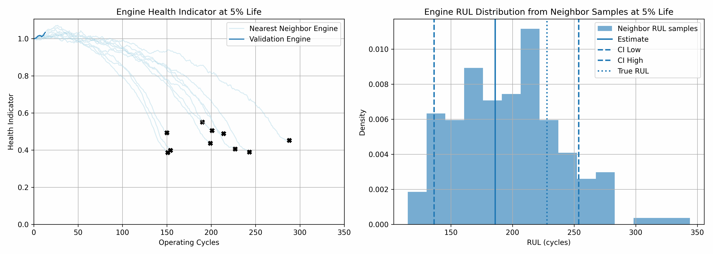
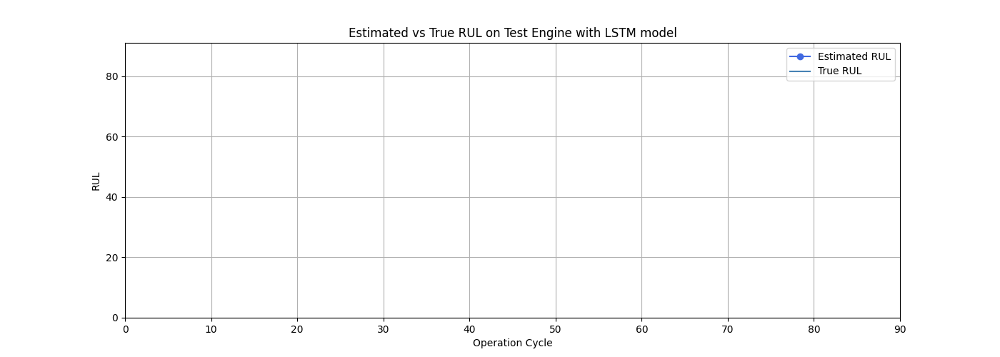

# Remaining Useful Life Estimation of Turbofan Engines

This repository contains a machine learning project aimed at predicting the Remaining Useful Life (RUL) of turbofan engines using the **PHM08 Prognostics Data Challenge Dataset** provided by NASA. Accurate RUL Estimation can enable proactive maintenance, reduce operational costs, and prevent unexpected failures.

## 📊 Dataset Overview

The PHM08 dataset includes:

- **218 engine units**: Each representing a unique turbofan engine.
- **21 sensor measurements**: Including fan speed, pressure, temperature, and vibration parameters.
- **Degradation trajectories**: Each engine's data spans from normal operation to failure.
- **Training and test sets**: Provided for model development and evaluation.

Source: [PHM08 Challenge Data Set](https://data.nasa.gov/dataset/phm-2008-challenge)

## 🚀 To get started with RUL predicton project:

1. Clone the repository:

   ```
   git clone https://github.com/palscruz23/rul-estimation.git
   cd rul-estimation
   ```

2. Install dependencies

   ```
   pip install -r requirements.txt
   ```

  
3. Run RUL using machine learning methods

    Change directory to machine-learning folder
    ```
    cd machine-learning
    ```
    Open streamlit app for the RUL Estimation visualization
    ```
    streamlit run src/Main.py
    ```
  
1. Run RUL using deep learning methods (RNN, LSTM, Seq2Seq, Informer models)
    Change directory to deep-learning folder
    ```
    cd deep-learning
    ```
    Start the FastAPI server using Uvicorn:
    ```
    uvicorn service.service:app --reload --host 127.0.0.1 --port 8000
    ```
    Run inference from `service/predict.py` script. 
    ```
    python -m service.predict 
    ```

## 📚 Projects Overview
### <i>Remaining Useful Life Estimation using machine learning techniques</i>
 - Data Exploration
   - Load training and test data
   - Utilise unsupervised learning (K-means) to get operational parameter clusters
 - Data Processing
   - Split data set into training and validation sets
   - Apply Standard Scaler to normalise different sensor measurements
 - Remaining Useful Life Estimation
   - Construct Asset Health Indicator
   - Perform Linear Regression on each sensor to get trendability
   - Perform sensor fusion to develop health indicator
   - Develop Residual-similarity model using Degree-2 polynomial fit
   - Plot health indicator of validation engine from 5% to 100% operating life
 
#### 📉 RUL Estimation using ML Demo

 

#### 📃 References
[1] [MATLAB Similarity-Based Remaining Useful Life Estimation](https://au.mathworks.com/help/predmaint/ug/similarity-based-remaining-useful-life-estimation.html)

[2] [A similarity-based prognostics approach for Remaining Useful Life estimation of engineered systems](https://ieeexplore.ieee.org/document/4711421)


 ### <i>Remaining Useful Life Estimation using deep learning techniques</i> 
 - Data Processing
   - Load training data
   - Split data set into training, validation and test sets
   - Perform scaling using StandardScaler
   - Create PHM08RULDataset dataset class
 - Remaining Useful Life Estimation
   - Initiate ML flow experiment
   - Create model classes for RNN, LSTM, Seq2Seq and Informer
   - Prepare training and validation loops
   - Perform grid search for hyperparameter tuning
   - Select best model
   - Perform bias vs variance analysis
   - Perform Estimation on test data.

#### 📉 RUL Estimation using DL Demo

 

#### 📃 References

[1] [Recurrent neural networks for remaining useful life estimation](https://ieeexplore.ieee.org/document/4711422)

[2] [Recurrent Neural Network (RNN)](https://medium.com/@RobuRishabh/recurrent-neural-network-rnn-8412b9abd755)

[3] [Understanding LSTMs](https://colah.github.io/posts/2015-08-Understanding-LSTMs/)

[4] [Understanding the Seq2Seq Model](https://medium.com/@infin94/understanding-the-seq2seq-model-what-you-should-know-before-understanding-transformers-e5891bcd57ec)

[5] [Informer: Beyond Efficient Transformer for Long Sequence Time-Series Forecasting](hhttps://arxiv.org/pdf/2012.07436)

## 📜 License

This repository is licensed under the MIT License. See the [LICENSE](LICENSE) file for more details.

