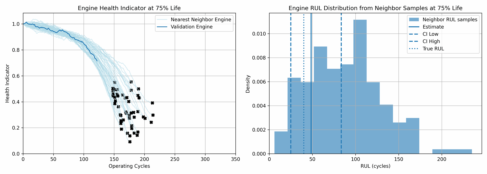

# Remaining Useful Life Prediction of Turbofan Engines

This repository contains a machine learning project aimed at predicting the Remaining Useful Life (RUL) of turbofan engines using the **PHM08 Prognostics Data Challenge Dataset** provided by NASA. Accurate RUL prediction can enable proactive maintenance, reduce operational costs, and prevent unexpected failures.

## 📊 Dataset Overview

The PHM08 dataset includes:

- **218 engine units**: Each representing a unique turbofan engine.
- **21 sensor measurements**: Including fan speed, pressure, temperature, and vibration parameters.
- **Degradation trajectories**: Each engine's data spans from normal operation to failure.
- **Training and test sets**: Provided for model development and evaluation.

More details: [PHM08 Challenge Data Set](https://data.nasa.gov/dataset/phm-2008-challenge)

## 🚀 To get started with RUL predicton project:

1. Clone the repository:

   ```
   git clone https://github.com/palscruz23/rul-prediction.git
   cd rul-prediction
   ```

2. Install dependencies

   ```
   pip install -r requirements.txt
   ```

3. Run the RUL prediction script
    ```
   python src\main.py 
   ```

## 📚 Projects Overview
### <i>Remaining Useful Life Prediction using machine learning techniques</i>
 - Data Exploration
   - Load training and test data
   - Utilise unsupervised learning (K-means) to get operational parameter clusters
 - Data Processing
   - Split data set into training and validation sets
   - Apply Standard Scaler to normalise different sensor measurements
 - Remaining Useful Life Prediction
   - Construct Asset Health Indicator
   - Perform Linear Regression on each sensor to get trendability
   - Perform sensor fusion to develop health indicator
   - Develop Residual-similarity model using Degree-2 polynomial fit
   - Plot health indicator of validation enginer from 5% to 100% operating life
- Notebook: 
   ```
   notebooks/Engine Remaining Useful Life using ML.ipynb
   ```

 Methodology inspired by MATLAB Similarity-Based Remaining Useful Life Estimation (https://au.mathworks.com/help/predmaint/ug/similarity-based-remaining-useful-life-estimation.html)

#### 📉 RUL Prediction using ML Demo

 

 ### <i>Remaining Useful Life Prediction using deep learning techniques</i> (Under construction)
 - Data Processing
   - Load training and test data
   - Split data set into training and validation sets
   - Create PHM08RULDataset dataset class
 - Remaining Useful Life Prediction
   - Initiate ML flow experiment
   - Create model classes for RNN, LSTM, Seq2Seq and Informer
   - Prepare training and validation loops
   - Perform grid search for hyperparameter tuning
   - Select best model
   - Perform bias vs variance analysis
   - Perform prediction on test data.
  - Notebook: 
      ```
      notebooks/Engine Remaining Useful Life using DL.ipynb
      ```

## 📜 License

This repository is licensed under the MIT License. See the [LICENSE](LICENSE) file for more details.

